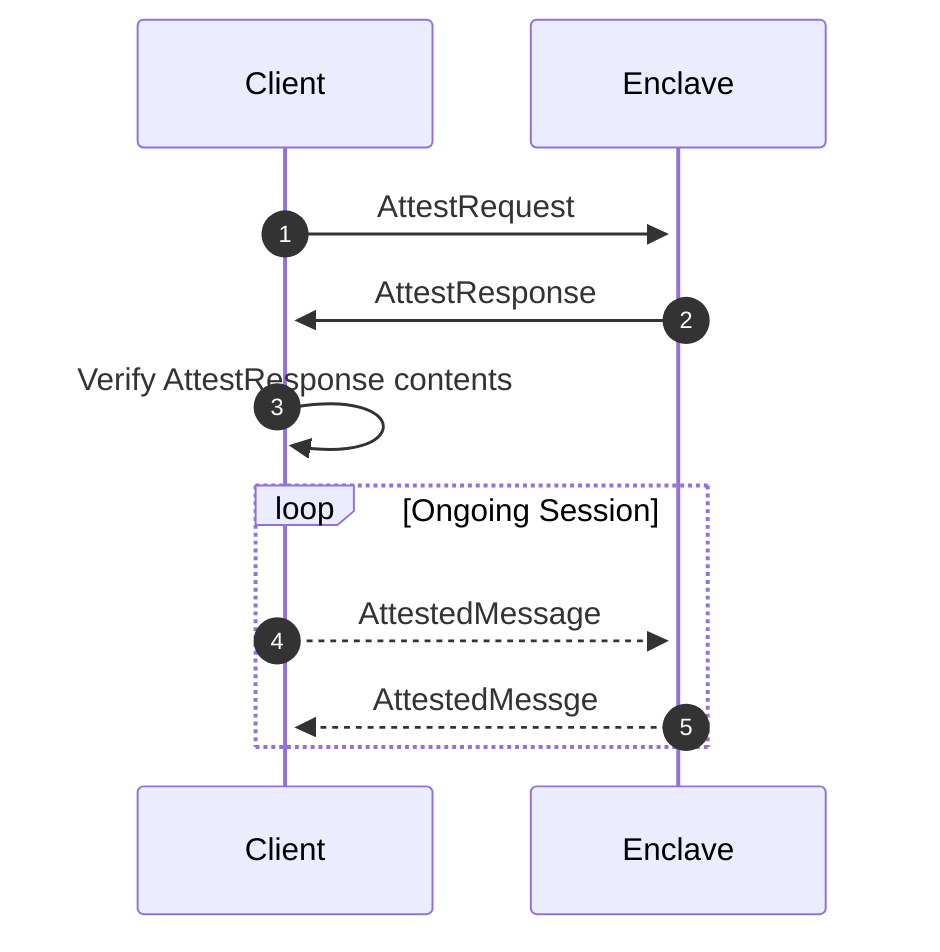
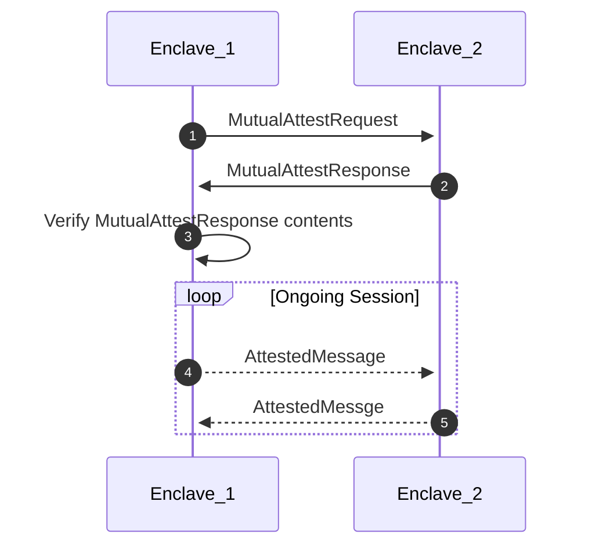

# AttestAPIs

The APIs required to interact with the `AttestService`.

There are two ways to attest with an encalve:

1. Client to enclave. Used when a (non enclave) client wants to attest that the
   enclave is a predetermined software image.
2. Enclave to enclave. This is for attesting between two trusted enclaves
   running the same software image.

## Client to Enclave

## Enclave to Enclave

